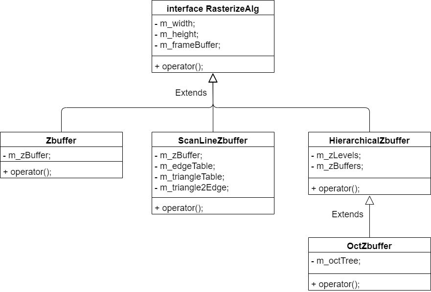
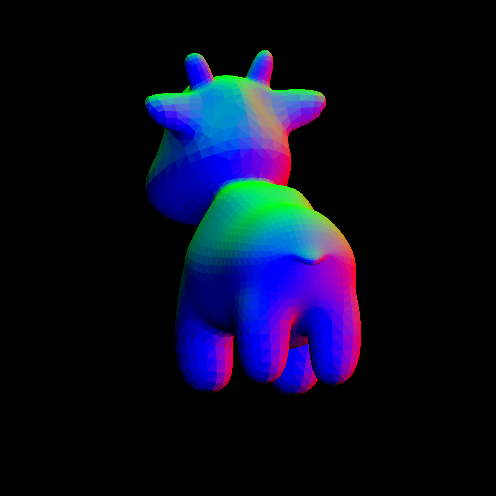
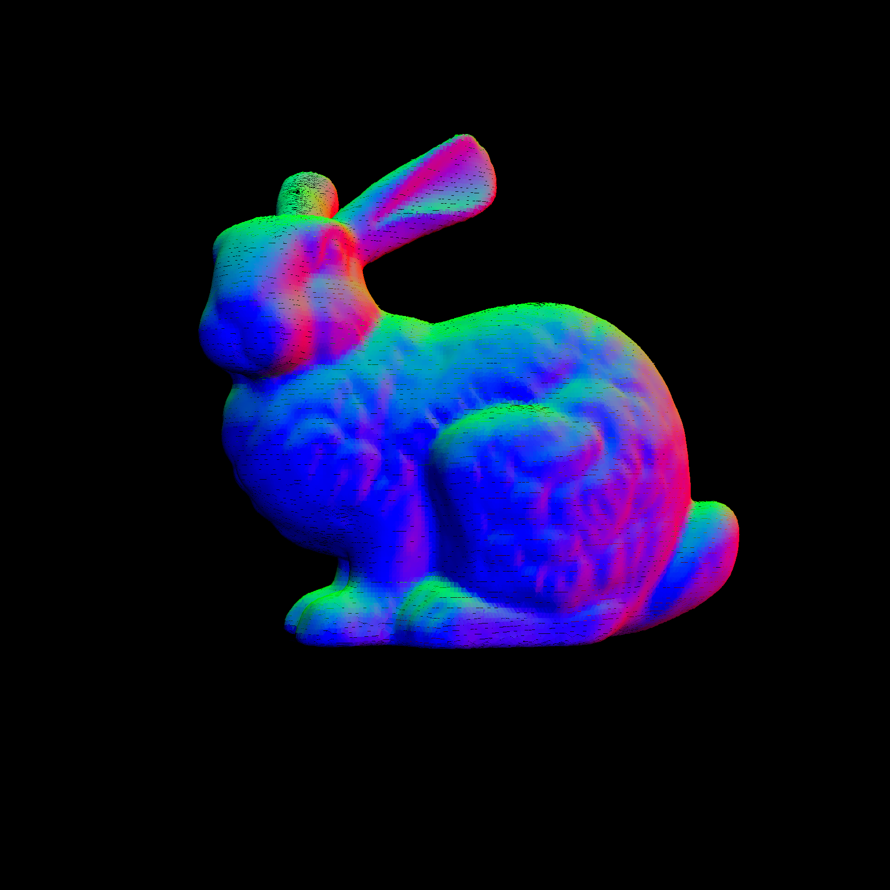
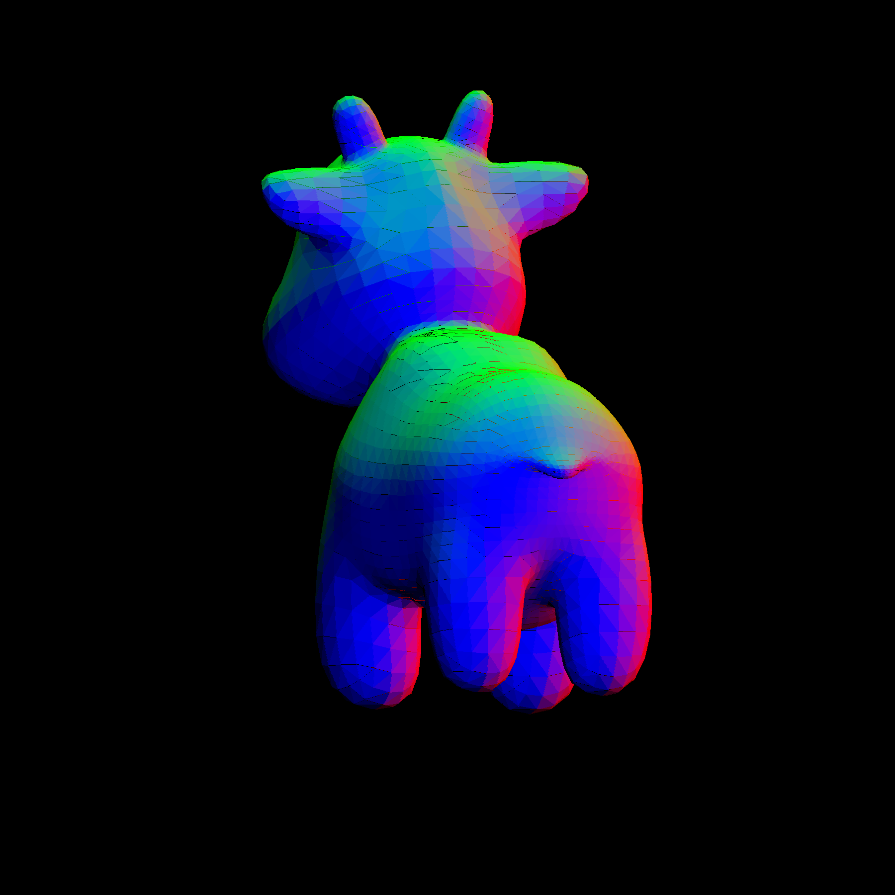
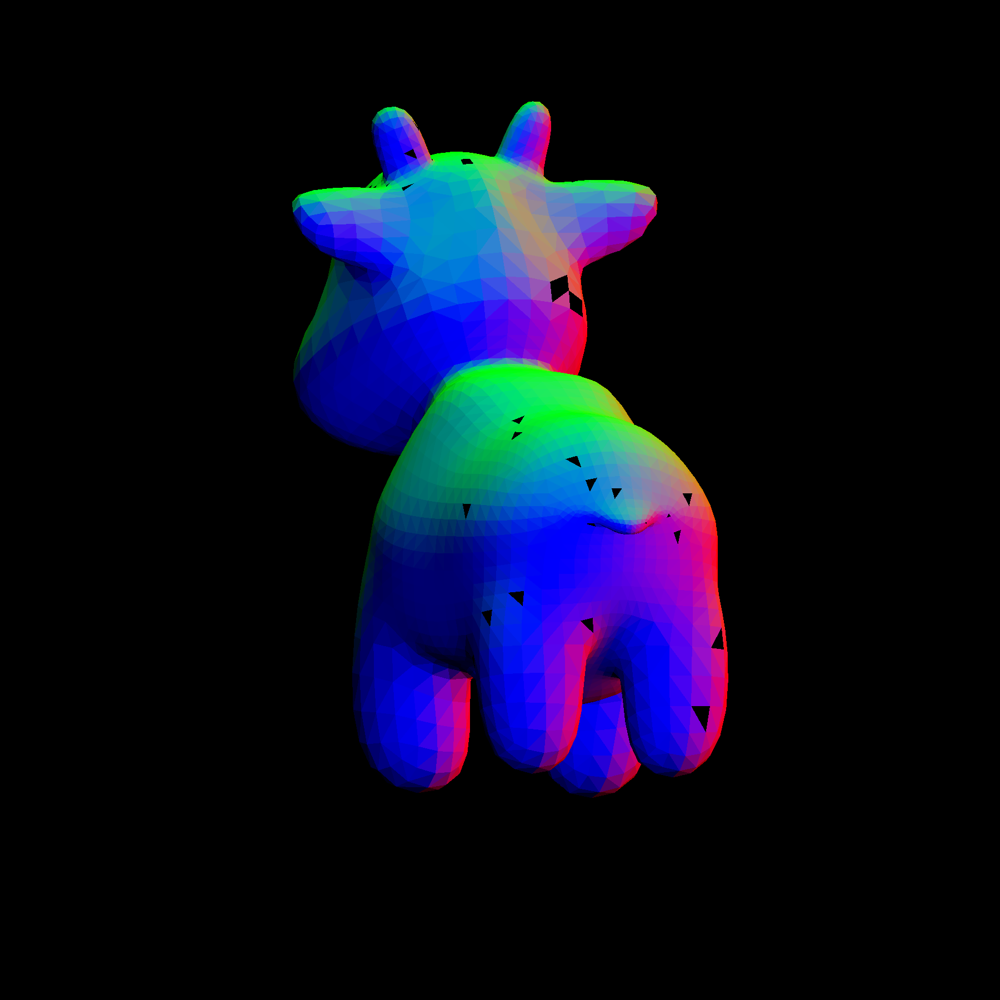

# 八叉树层次zbuffer算法实现

### 项目目录说明

- assets：存放光栅化的最终结果
- dependency：依赖库，包含了调试用的日志库与Json解析库
- models：包含了多种obj格式的模型和不同模型的参数配置
- results：光栅化结果临时目录
- src：源码目录
- tests：测试文件目录

### 项目运行说明

项目使用CMake进行构建，依赖OpenCV库，运行前请修改CMakeLists.txt中的OpenCV路径。其它的依赖库均以源码的形式附加在`dependency`目录下，不需要自行添加。

`Rasterizer.cpp`文件中，第67行`setRasterizeAlg`方法用于设置具体的光栅化算法，可选算法以注释的方式在67到70行中提供。

`main.cpp`是主文件，`main`函数中`rasterizeModel`函数用于选择模型，传入一个字符串，可选模型包括：
- "bunny"
- "spot"

## 1 框架介绍

该项目框架基本遵循Games101的作业框架，主要文件如下：
- OBJ_Loader.h：来自Games101框架，用于读取obj模型
- Triangle.h：定义三角形面片的操作
- Rasterizer.h：主要文件，定义光栅化器

以下文件与渲染相关，本项目中暂未加入：
- Texture.h：纹理相关
- Shader.h：渲染器相关

项目使用OpenCV作为计算框架重写了Games101的框架，以简化后续编码。

光栅化器中包含了MVP变换与光栅化算法接口，确定好MVP变换后，光栅化器以场景作为输入，输出为一个frameBuffer矩阵。关于Rasterizer的总结如下：
- 输入：场景，用`std::vector<Triangle>`表示
- 输出：frameBuffer，用`cv::Mat3f`表示
- 算法接口：函数对象或仿函数，用`std::function<cv::Mat3f(const std::vector<Triangle> &)>`表示

项目实现了4个具体的算法：
- 原始zbuffer算法
- 扫描线zbuffer算法
- 层次zbuffer算法
- 具有八叉树加速结构的层次zbuffer算法

4个具体的算法均实现了抽象类`RasterizeAlg`的接口，并重载了
``` cpp
cv::Mat3f operator()(const std::vector<Triangle> &);
```
用于与Rasterizer对接。它们的继承关系如下图所示。



对于不同的模型，MVP变换与视点位置可能会影响到遮挡关系，合适的配置应使得视点在模型之外，调整视角大小，向z轴负方向观测。我们提供了合适的场景参数，存放在`models/settings.json`文件中，可将配置同步到`main`程序中，由jsoncpp解析读取。

``` json
{
    "bunny": {
        "path": "models/bunny/bunny.obj",
        "width": 1800,
        "height": 1800,
        "eye": [-0.5, 0.8, 10.0],
        "angle": 0.0,
        "axis": [0.0, 1.0, 0.0],
        "project": [30.0, 1.0, -1.0, -50.0]
    },
    "spot": {
        "path": "models/spot/spot_triangulated_good.obj",
        "width": 1800,
        "height": 1800,
        "eye": [0.0, 0.0, -10.0],
        "angle": 20.0,
        "axis": [0.0, 1.0, 0.0],
        "project": [15.0, 1.0, -0.1, -50.0]
    }
}
```

我们选取以下两个模型作为最后的测试用例：
- `models/bunny/bunny.obj`（69630 triangles）
- `models/spot/spot_triangulated_good`（5856 triangles）

## 2 Zbuffer算法

Zbuffer算法相对简单，对于每个三角形进行深度插值和深度测试，在屏幕上绘制距离屏幕最近的三角形的颜色。伪代码描述如下：
``` cpp
minx, maxx, miny, maxy = boundingBox(triangle);
for (i = minx to maxx)
{
    for (j = miny to maxy)
    {
        if (insideTriangle(i, j, triangle))
        {
            zInterpolated = interpolate(i, j, triangle);
            if (zInterpolated < m_zBuffer(i, j))
            {
                m_zBuffer(i, j) = zInterpolated;
                m_frameBuffer(i, j) = triangle.getNormalColor();
            }
        }
    }
}
```




## 3 ScanLineZbuffer算法

### 3.1 数据结构说明

边用结构体`Edge`表示，`flag`表示是否处理完该条边，处理完一条边后将`flag`置为`false`。
``` cpp
struct Edge
{
    float x;    // upper x coordinate
    float y;    // upper y coordinate
    float dx;   // delta x bewteen 2 consecutive scan line
    int dy;     // how many scan lines the edge span 
    int index;  // index of triangle to which the edge belongs
    bool flag;
    Edge() { flag = false; }
};
```

确定场景后，可以提前构建边表与多边形表，这里为三角形表。
``` cpp
std::vector<std::list<std::shared_ptr<Edge>>> m_edgeTable;
std::vector<std::vector<int>> m_triangleTable;
```

在光栅化过程中，需要构建活化边表与活化多边形表，这里为活化三角形表。
``` cpp
// active edge table (AET)
std::list<EdgePair> activeEdgeTable;
// active polygon table (APT)
std::set<int> activeTriangleTable;
```

### 3.2 算法说明

扫描线自上而下扫描，期间不断更新活化多边形表和活化边表。需要注意的是，在两个时刻可能需要更新活化边表：
- 扫描线触碰到新的三角形时
- 三角形一条边处理完毕时

第二种情况是因为当一条边处理完毕时，边对中的另一条可能还未处理完毕，此时，需要将未处理完毕的边的剩余部分与三角形的另一条还没处理过的边组成新的边对加入到活化边表中。

在判断某一条扫描线是否与某一条边相交时，是整数与浮点数的大小比较，可能会出现误差，因此在相交函数`cross`中，我们使用了如下条件进行判断，使用`edge->y + 1`而不是`edge->y`：
``` cpp
edge->y + edge->dy < line && edge->y + 1 >= line
```

为了建立`Triangle`结构与`Edge`结构之间的关联，我们添加了一个结构
``` cpp
std::vector<std::array<std::shared_ptr<Edge>, 3>> m_triangle2Edge;
```





### 3.3 遗留问题

可以看到，扫描线的结果中三角形边缘存在缺口。这是因为在`ScanLineZbuffer.cpp`文件的第102行中，我们对扫描线的起止做了以下约定：
``` cpp
int x1 = std::round(edge1->x);
int x2 = std::round(edge2->x);
```
理论上，左右两侧边界应该采用同一种舍入策略，以保证不会出现位置重叠，然而实际中采取以下方案得到的结果会比上面的结果好得多：
``` cpp
int x1 = std::round(edge1->x);
int x2 = std::round(edge2->x) + 1;
```
虽然能够弥补边界，但如此简单粗暴地修改起始边界可能是不正确的解决方案，由于没有找到更加合适的解决方案，因此仍然保留“理论正确”的结果。

## 4 HierarchicalZbuffer算法

项目一开始并没有使用四叉树作为层次zbuffer，而是使用更加简单的矩阵数组
``` cpp
std::vector<cv::Mat1f> m_zBuffers;
```
虽然这么做在寻找合适的zbuffer层次时会变得更加简单，但在之后可以看到，这么做可能会引起严重的效率问题，因时间有限，本次提交尚未进行修改。

层次zbuffer的思想是提前拒绝显然不应该被绘制的三角形，表述如下：
``` cpp
for (each triangle)
{
    x, y, level = getTriangleLevel(triangle);
    if (zMax > m_zBuffers[level](x, y)) 
    {
        reject(triangle);
    } 
    else 
    {
        ZbufferAlg(triangle);
    }
}
```

层次zbuffer算法在绘制部分沿用了zbuffer算法的代码，主要实现的部分在于提前拒绝，两个主要的操作是获取合适的zbuffer层与更新zbuffer层。合适的zbuffer层应包含待绘制的三角形，即三角形包围盒在x和y方向上的跨度不超过1。这可以通过计算实现，然而为了方便编写代码，此处实现为循环：
``` cpp
int xLevel = 0;
while (xMax - xMin > 1)
{
    xMax /= 2;
    xMin /= 2;
    xLevel++;
}
```
虽然可以简单地获取zbuffer层次和坐标，但是也会引起严重的效率问题，仍然有待改进。




## 5 OctZbuffer算法

### 5.1 八叉树实现

八叉树结点包含了以下信息：
- 结点包围盒
- 结点存储的三角形
- 孩子指针

``` cpp
AABB aabb;
std::vector<Triangle> triangles;
std::array<std::shared_ptr<OctTreeNode>, 8> children;
```

根据场景可以提前构建八叉树，且在构建的过程中可以进行背面剔除。构建过程如下：
1. 判断三角形是否需要绘制，如在背面则直接跳过
2. 判断三角形是否能被孩子结点包围
3. 若不能包围，将三角形加入当前结点

判断三角形是否能被孩子结点包围需要重复8次，我们使用宏来定义这样的操作，其中`idx`取值从0到7：
``` cpp
#define XX(idx, x1, y1, z1, x2, y2, z2) \
    subAABB = AABB(center + cv::Vec3f(x1, y1, z1), center + cv::Vec3f(x2, y2, z2)); \
    if (subAABB.containTriangle(triangle)) \
    { \
        if (node->children[idx] == nullptr) \
        { \
            node->children[idx] = std::make_shared<OctTreeNode>(); \
            node->children[idx]->aabb = subAABB; \
        } \
        node = node->children[idx]; \
        continue; \
    }
```

### 5.2 算法说明

对应于层次zbuffer算法，在八叉树加速结构中将三角形换成八叉树结点，实现如下两个函数即可。
``` cpp
void drawTreeNode(std::shared_ptr<TreeNode> node);
std::tuple<int, int, int> getTreeNodeLevel(std::shared_ptr<TreeNode> node);
```

具体实现与层次zbuffer大同小异，只不过提前拒绝以结点为单位。若无法提前拒绝，则再次对结点中的三角形调用层次zbuffer中的`drawTriangle`函数。

我们在子类中并未重写`drawTriangle`函数，理论和实验均表明，最终光栅化结果与层次zbuffer完全一致，但速度提升了许多。

## 6 算法比较

我们计算了不同算法光栅化同一个模型的运行时间。此处我们将时钟设置在`operator()`操作的起止位置，而不包含可以根据场景提前构建的内容。

我们对同一个模型和同一个算法运行5次，将5次的平均值作为最后结果列在表格中。

以下是-O0的结果，主要的一个问题是原始zbuffer比层次zbuffer快，前面也讲到过，项目中层次zbuffer的实现比较丑陋，没有使用四叉树而使用数组，寻找层次zbuffer时直接循环按照定义进行搜索等等阴间操作大大拉低了效率。不过，如果我们将Zbuffer和ScanLineZbuffer作为一组，而HierarchicalZbuffer和OctZbuffer作为一组，两两对比，可以看到提升还是十分显著的。

|model|Zbuffer|ScanLineZbuffer|HierarchicalZbuffer|OctZbuffer|
|-|-|-|-|-|
|spot|1736.91|858.613|2089.6|1492.13|
|bunny|2094.39|1336.02|2456.5|1708.09|

让我们看看编译器能不能把实现不太好的地方优化一下，以下是-O3的运行结果，Zbuffer的速度反而是最快的，可能是因为Zbuffer循环比较简单，而其他算法都不存在类似与Zbuffer的完整大循环，-O3循环展开占了主要的功劳。

|model|Zbuffer|ScanLineZbuffer|HierarchicalZbuffer|OctZbuffer|
|-|-|-|-|-|
|spot|61.1228|50.7456|87.6793|73.0219|
|bunny|82.1442|140.117|109.276|88.6806|

看起来，编译器比人有用。不过这都是软件模拟的，真正到了GPU上肯定又是不一样的结果，总的来说，-O0的速度比较还是可以分出高下，扫描线Zbuffer和八叉树加速的层次Zbuffer占优势。